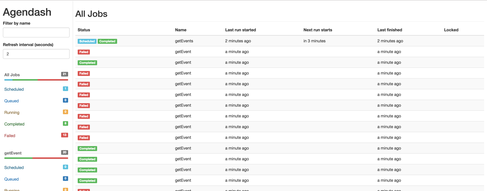
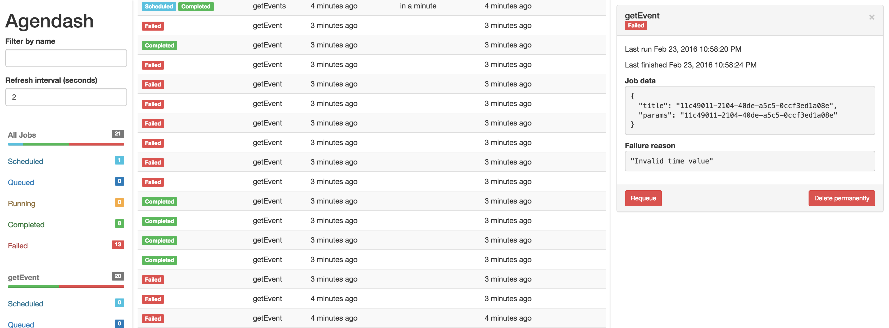

# Agendash
[](https://travis-ci.org/agenda/agendash)

A Dashboard for [Agenda](https://github.com/rschmukler/agenda)

---

### Features

- Job status auto-refreshes (2-second polling by default)
- Schedule a new job from the UI
- Dive in to see more details about the job, like the json data
- Requeue a job (clone the data and run immediately)
- Delete jobs (Useful for cleaning up old completed jobs)

### Notes

 - Automatically creates additional indexes on several columns (See #24).

---

### Screenshots



---



---

### Install

```
npm install --save agendash
```

*Note*: `Agendash` requires mongodb version >2.6.0 to perform the needed aggregate queries. This is your mongo database version, not your node package version! To check your database version, connect to mongo and run `db.version()`.

### Standalone usage

Agendash comes with a standalone Express app which you can use like this:

```bash
./node_modules/.bin/agendash --db=mongodb://localhost/agendaDb --collection=agendaCollection --port=3001
```

or like this, for default collection `agendaJobs` and default port `3000`:

```bash
./node_modules/.bin/agendash --db=mongodb://localhost/agendaDb
```

If you are using npm >= 5.2, then you can use [npx](https://medium.com/@maybekatz/introducing-npx-an-npm-package-runner-55f7d4bd282b):

```bash
npx agendash --db=mongodb://localhost/agendaDb --collection=agendaCollection --port=3001
```

### Middleware usage

Agendash provides Express middleware you can use at a specified path, for example this will
make Agendash available on your site at the `/dash` path. Note: Do not try to mount Agendash
at the root level like `app.use('/', Agendash(agenda))`.

```js
var express = require('express');
var app = express();

// ... your other express middleware like body-parser

var Agenda = require('agenda');
var Agendash = require('agendash');

var agenda = new Agenda({db: {address: 'mongodb://127.0.0.1/agendaDb'}});
// or provide your own mongo client:
// var agenda = new Agenda({mongo: myMongoClient})

app.use('/dash', Agendash(agenda));

// ... your other routes

// ... start your server
```

By mounting Agendash as middleware on a specific path, you may provide your
own authentication for that path. For example if you have an authenticated
session using passport, you can protect the dashboard path like this:

```
app.use('/dash',
  function (req, res, next) {
    if (!req.user || !req.user.is_admin) {
      res.send(401);
    } else {
      next();
    }
  },
  Agendash(agenda)
);
```

Other middlewares will come soon in the folder `/lib/middlewares/`.
You'll just have to update the last line to require the middleware you need: 

```js
app.use('/agendash', Agendash(agenda, {
  middleware: 'koa'
}));
```

Note that if you use a CSRF protection middleware like [`csurf`](https://www.npmjs.com/package/csurf), you might need to [configure it off](https://github.com/agenda/agendash/issues/23#issuecomment-270917949) for Agendash-routes.

### Additional options

The second argument to Agendash is an optional object. Valid keys are:

- `middleware`: Currently only `'express'` is supported. I'd like to use `'koa'` soon.
- `title`: Defaults to `"Agendash"`. Useful if you are running multiple Agenda pools.

### Help appreciated

There are several things I would like help with:

-  [ ] I'm rusty with Backbone. Clean up the client code. I wasn't sure on the best way to trigger and handle update events.
-  [ ] Write some tests!
-  [ ] Use Agendash and submit issues!
